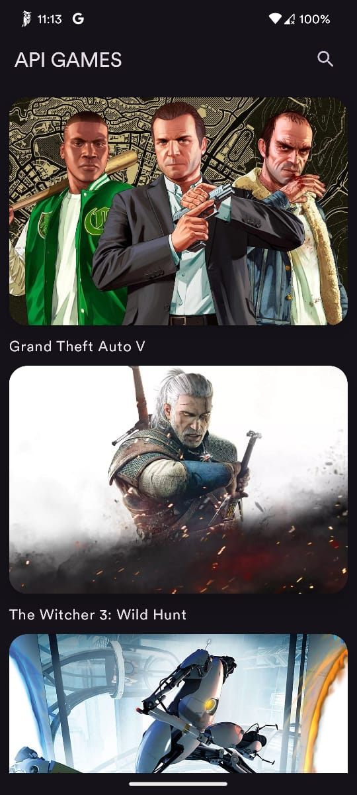

# Game Finder 🎮

A modern Android application for discovering and exploring games, built with the latest Android development technologies.

<div style="display: flex; gap: 10px;">
    
    
</div>

## 🚀 Features

- Modern designed game list
- Real-time game search
- Detailed view with game description and image
- Direct link to game website
- Modern UI with Material 3

## 🛠️ Tech Stack

- **Kotlin** - Primary language
- **Jetpack Compose** - Modern UI toolkit
- **Material 3** - Design system
- **Clean Architecture** - Project architecture
- **Retrofit** - HTTP client for API consumption
- **Coil** - Async image loading
- **Coroutines** - Async programming
- **Flow** - Reactive data streams
- **Hilt** - Dependency injection
- **ViewModel** - UI state management

## ⚙️ Requirements

- Android Studio Koala or higher
- Kotlin 2.0 or higher
- minSdk: 24
- compileSdk: 35

## 🚀 Installation

1. Clone repository
```bash
git clone https://github.com/[your-username]/game-finder.git
```

2. Open project in Android Studio

3. Sync project with Gradle

4. Run the app
